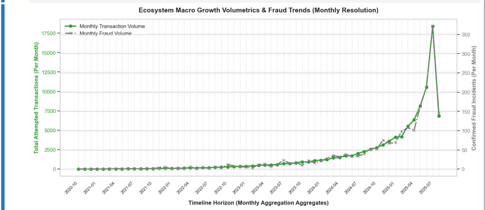
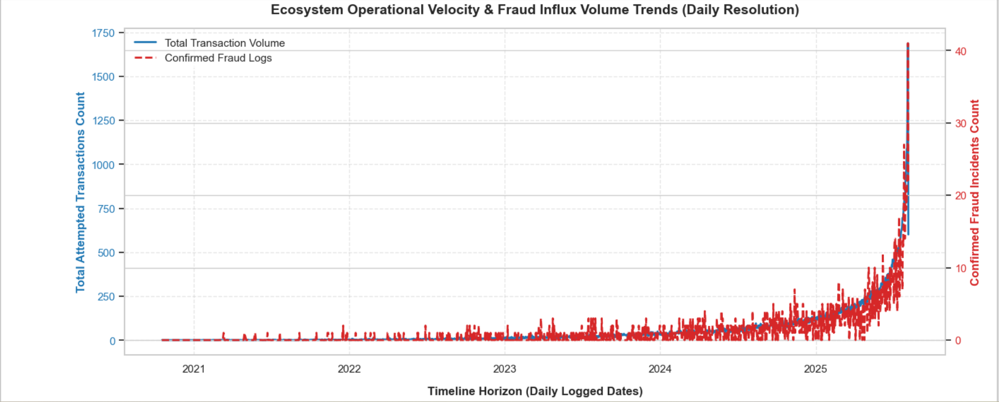
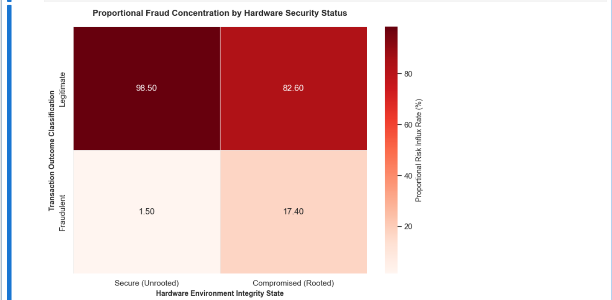
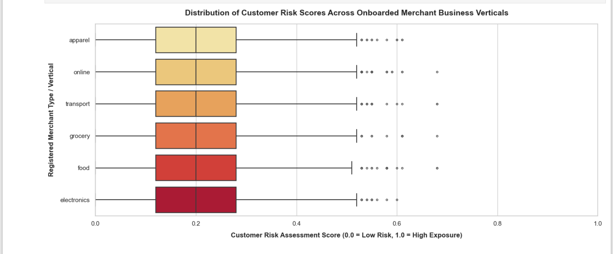
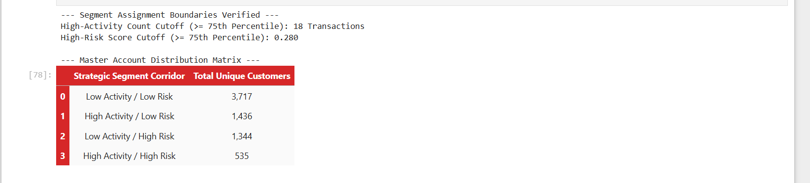
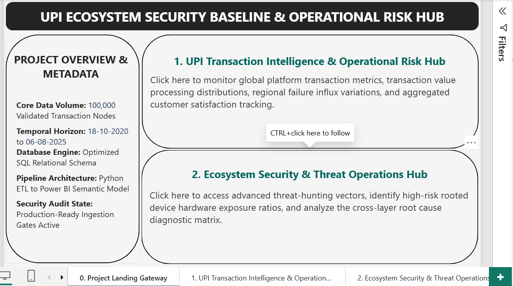
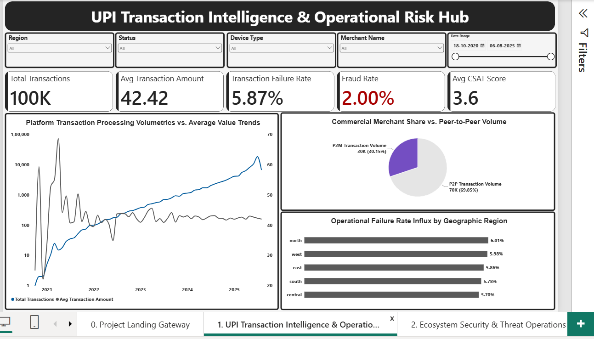
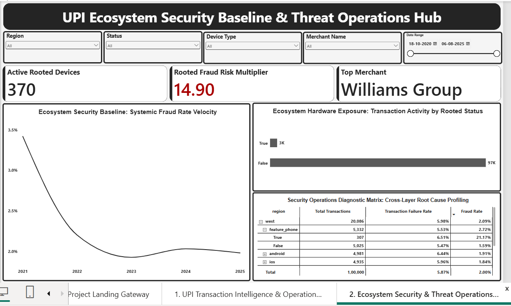

 # UPI Transaction Intelligence and Risk Mitigation Engine

This repository contains an end-to-end data analytics, statistical auditing, and business intelligence project. The primary objective is to analyze transaction failures, identify system vulnerabilities, and isolate fraud patterns across a 100,000-node database spanning from October 2020 to August 2025.

## Core Performance Metrics and System Baselines

* Global Technical Failure Rate: 5.87% (Totaling 5,871 transactions across the ledger).
* Processing Channel Performance: App Interface (6.00% failure rate), Intent Layer (5.90%), and QR Code (5.71%).
* Banking Partner Latency Profiles: Kotak Bank exhibits the highest technical failure rate at 6.00%, followed by Axis Bank (5.99%), PNB (5.89%), ICICI (5.88%), HDFC (5.78%), and SBI (5.69%).
* Global Fraud Incident Rate: 2.00% baseline across all recorded payment requests.

## Transaction Trends and Volume Growth

The transaction ledger shows stable, low-volume baselines from late 2020 through mid-2024. Starting in the second half of 2024, the platform experienced exponential growth in transaction volumes. This sudden increase in scaling is closely tied to a sharp rise in confirmed fraud incidents, creating a need for automated detection tools.

---

## Inferential Statistical Analysis and Hypothesis Testing

### 1. Spending Volume Evasion Analysis (Welch's Independent T-Test)
* Test Objective: Evaluate if the average transaction values of fraudulent events differ significantly from legitimate checkouts.
* Results: T-Statistic = -0.0841 | p-value = 0.9330
* Strategy Outcome: Fail to reject the null hypothesis.
* Business Conclusion: Legitimate transactions (Mean: 42.42 INR) and fraudulent transactions (Mean: 42.36 INR) are statistically identical. Fraud actors are intentionally structuring their transaction amounts to blend in with normal consumer spending and bypass basic value threshold alerts.

### 2. Device Security and Firmware Vulnerability Scan (Chi-Square Test of Independence)
* Test Objective: Measure the statistical relationship between compromised device states (rooted firmware) and confirmed fraud flags.
* Results: Chi2 Statistic = 4729.1271 | p-value = 0.0000 | Degrees of Freedom = 1
* Strategy Outcome: Reject the null hypothesis with high confidence.
* Business Conclusion: Compromised device firmware is a critical risk factor for fraud. While secure devices maintain a low 1.50% fraud baseline, rooted endpoints show a 17.40% fraud rate, indicating automated network compromises.

### 3. Industry Category Risk Auditing (One-Way ANOVA Variance Scan)
* Test Objective: Determine if fraud rates show a significant variance across different registered merchant business verticals.
* Results: F-Statistic = 0.8511 | p-value = 0.5275
* Strategy Outcome: Fail to reject the null hypothesis.
* Business Conclusion: Fraud rates are evenly distributed across all business verticals, including electronics, grocery, apparel, online retail, food, and transport. This disproves the theory of industry-specific risks and confirms that attacks target the platform uniformly.

### 4. Additional Infrastructure Screenings
* Routing Channels vs. Fraud Outcomes (Chi-Square): Chi2 = 3.8837, p-value = 0.1434. Outlining that fraud risks are uniform across App, Intent, and QR processing methods.
* Device Type vs. System Failures (Chi-Square): Chi2 = 5.9344, p-value = 0.4305. Confirming that processing performance drops occur equally across all hardware profiles.
* Numeric Parameter Linear Associations (Pearson r Correlation): Customer risk scores show near-zero linear correlation with immediate fraud incidents (r = -0.0016) and transaction frequency (r = -0.0162), indicating that risk factors follow non-linear patterns.

---

## Portfolio Risk Segmentation and Financial Exposure

By applying a 75th percentile filter to customer transaction frequency (equal to or greater than 18 transactions) and calculated risk scores (equal to or greater than 0.280), the account database was grouped into four distinct operational quadrants:

* High Activity / High Risk Quadrant: 535 high-velocity user accounts holding a total financial loss exposure of 10,580.04 USD.
* High Activity / Low Risk: 1,436 active accounts.
* Low Activity / High Risk: 1,344 accounts.
* Low Activity / Low Risk: 3,717 baseline verified accounts.

---

## Executive Business Intelligence Architecture

The visual reporting engine links these separate database components through an optimized Star Schema model inside Power BI. This enforces clean relational links without generating redundant data rows.

### Executive Visual Views

#### 1. Platform Navigation Gateway
Establishes clear, role-based entry paths for risk analysts and operational managers, keeping dashboard navigation secure and organized.

#### 2. Operational Risk Hub
Tracks overall system performance metrics, highlighting the 5.87% global failure rate, the 2.00% fraud baseline, and a 3.31 customer satisfaction score.

#### 3. Threat Operations Center
Links maps, merchant risk metrics, and device data together. Clicking any data point instantly updates the entire view to help track active threats.

